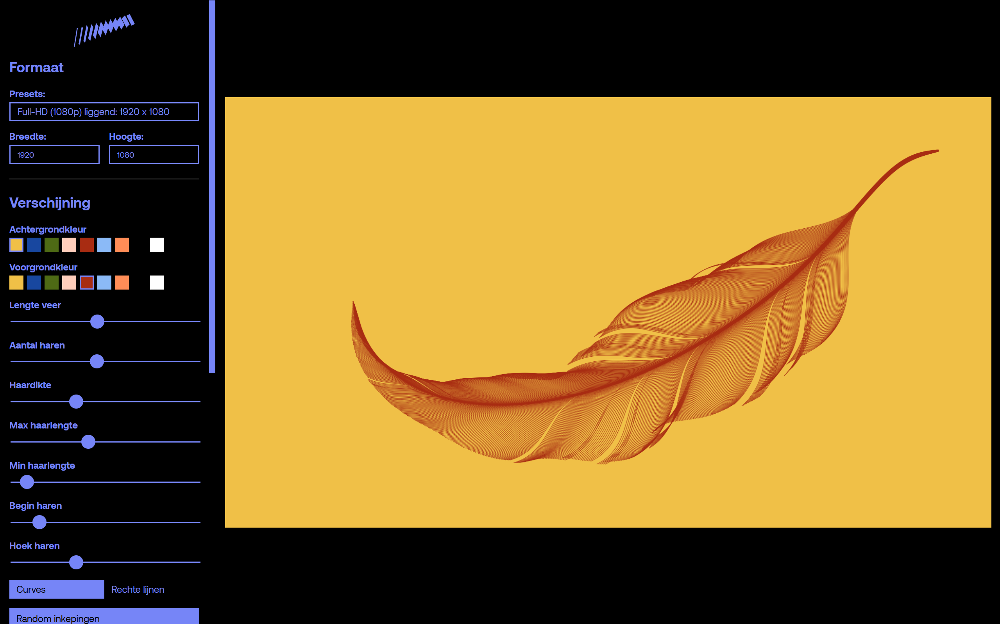

<p align="center">
	<a style="text-decoration:none !important;" href="./LICENSE"></a>
	<a style="text-decoration:none !important;" href="https://github.com/multitude-amsterdam/p5Catalyst/stargazers"></a>
	<a style="text-decoration:none !important;" href="https://github.com/multitude-amsterdam/p5Catalyst/watchers"></a>
	<a style="text-decoration:none !important;" href="https://github.com/multitude-amsterdam/p5Catalyst/graphs/contributors"></a>
	<a style="text-decoration:none !important;" href="https://github.com/multitude-amsterdam/p5Catalyst/graphs/commit-activity"></a>
	<a style="text-decoration:none !important;" href="https://github.com/multitude-amsterdam/p5Catalyst/forks"></a>
	<a style="text-decoration:none !important;" href="https://github.com/multitude-amsterdam/p5Catalyst/issues"></a>
	<a style="text-decoration:none !important;" href="https://github.com/multitude-amsterdam/p5Catalyst/pulls"></a>
</p>

---


# 🧪 What is p5Catalyst?

p5Catalyst is a GUI framework that wraps your `p5.js` sketches into polished, interactive web apps—ready for real-time control, asset exporting and daily use. Whether you're building generative art, data visualizations, or dynamic brand systems, p5Catalyst gives your sketches the structure and tooling they need to go beyond the sketchpad—into production, publication, or public play.

Initiated by creative agency [Multitude](https://multitude.nl/), p5Catalyst grew out of real-world branding needs, and is now shared as a creative coding tool for everyone.




# 🛠️ Features

- **Lives in the browser**: no install required, shareable and hackable by default.
- **Built-in GUI system**: add sliders, dropdowns, toggles, and color pickers with minimal setup.
- **Flexible and modular**: built in vanilla JavaScript, extend it however you like.
- **Export support**: save outputs as PNG, SVG, or video (MP4, WEBM) via ffmpeg.wasm.
- **Dark mode and theming**: UI respects system theme and is easy to style.
- **File I/O**: save/load user settings, support for `localStorage`.
- **Change history**: use CTRL+Z and CTRL+SHIFT+Z to undo and redo changes.
- **Internationalization**: plug in translations for global-ready tools.
- **Sketch integration**: integrate a finished p5 sketch easily.


# 👀 Demo

See it in action: [launch p5Catalyst from GitHub Pages](https://multitude-amsterdam.github.io/p5Catalyst/app/).


# 🔁 Why open-source?

At [Multitude](https://multitude.nl/), we believe branding should be fluid, flexible, and future-proof. Instead of static design systems, we embrace generative branding, where design systems evolve and adapt in real-time. 

We originally started building p5Catalyst to give our clients control over the generative brand systems we designed. Now we're sharing it to help other creative coders do the same, and more!

Let's build the future of generative design!


# 📥 Installation & setup

To run p5Catalyst locally, follow these steps. 

## 1. Clone the repository

```sh
git clone https://github.com/multitude-amsterdam/p5Catalyst.git YOUR_NEW_APP
```
or alternatively, download the code as a ZIP file by clicking the "**<> Code**" button at the top-right of this page. ↗️

## 2. Start a local development server

The `/app` directory holds the runnable website. You need to start a local web server (a "dev server") in this folder to use p5 and the other libraries. Opening the `index.html` file will not work on its own. Here are some options to do this in a command prompt window:

First, open a command prompt and navigate to the `/app` directory.
```sh
cd /Users/You/Your Github Folder/YOUR_NEW_APP/app
```

*If you have Python installed:*
```sh
python3 -m http.server 8000
```
*If you have Node.js installed:*
```sh
npx http-server -p 8000
```
*If you PHP installed:*
```sh
php -S localhost:8000
```
The app will be up and running at `http://localhost:8000`.

[More on running local web servers by Mozilla.](https://developer.mozilla.org/en-US/docs/Learn_web_development/Howto/Tools_and_setup/set_up_a_local_testing_server)

## 3. Create your generative sketch in `generator.js`
The `Generator` class in generator.js is designed to correspond with the `setup()` and `draw()` functions in p5. You can copy/paste your sketches in there. You won't need to use `createCanvas()`, as there is a `canvas` object available already. There is also some structure in place to help you get started with using shaders as well.
```javascript
class Generator {
	static name = 'Project Name';
	...
	setup() {
	...
	draw() {
	...
```

## 4. Create GUI elements in `create-gui.js`
There is a custom set of GUI controller classes that can be used, including sliders, text boxes, buttons, colour selectors, dropdowns and a toggle. You can add custom callback functions to handle the data from these DOM elements.
```javascript
...
gui.addController(new ColourBoxes(
	gui, 'colourBoxesBirdCol', 'Bird flock colour', generator.birdPalette, 0,
	(controller, value) => {
		generator.birdCol = value;
	}
));
...
```

## 5. Customise the styling in `style.css`
Most of the styling variables can be found under `:root`, like colours, sizes and font settings.
```css
:root {
	...
	--gui-base-col: #7685F7;
	...
```

## 6. Plop it on a server!

That's it! You can now host the application 😶‍🌫️ and send it to your client or users for testing. Just copy the contents of the `/app` folder into the root of your server environment using FTP or otherwise.


# 🤝 Contributing

We encourage you to make modifications, improvements, or entirely new generators, it's easier than you think! For more information on contributing, continue reading [here](./CONTRIBUTING.md). 

For security concerns, please review the [security policy](./SECURITY.md).

# 🌍 Sharing your work

We kindly ask: if you make something cool with p5Catalyst, please share it! Whether it's a wild new web app, an adaptation for a client, or just a fun remix, **we'd love to see it 👀**! 

- Create a new thread in the [**Show and tell section of the Discussions**](https://github.com/multitude-amsterdam/p5Catalyst/discussions/categories/show-and-tell)
- Share **screenshots** or videos of your creations
- Mention us if you publish your forked project online

Keep in mind the [**Community Code of Conduct**](./CODE_OF_CONDUCT.md) for this project.


# ❤️‍🔥 Credits

Developed using [p5.js](https://p5js.org/), [p5.js-svg](https://github.com/zenozeng/p5.js-svg), [toxiclibs.js](https://github.com/hapticdata/toxiclibsjs), and [ffmpeg.wasm](https://github.com/ffmpegwasm/ffmpeg.wasm).


# 🧾 License

This project is licensed under the [**MIT License**](./LICENSE): free to use and modify.


# 📢 Stay Updated

Follow the development and join the discussion:
- GitHub Discussions: [join the conversation](https://github.com/multitude-amsterdam/p5Catalyst/discussions)
- Multitude's Instagram: [@multitudecreativeagency](https://www.instagram.com/multitudecreativeagency/)
- Creative Coding Amsterdam: [join a Meetup](https://www.meetup.com/nl-NL/creative-coding-amsterdam/) and ask Aidan about this project in person 🤔🤔 or [find the Discord server here](https://cca.codes/) 👋

---