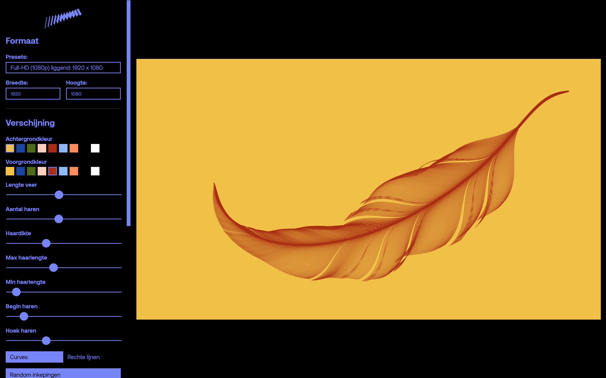

<p align="center">
	<a style="text-decoration:none !important;" href="./LICENSE"></a>
	<a style="text-decoration:none !important;" href="https://github.com/multitude-amsterdam/p5Catalyst/stargazers"></a>
	<a style="text-decoration:none !important;" href="https://github.com/multitude-amsterdam/p5Catalyst/graphs/contributors"></a>
	<a style="text-decoration:none !important;" href="https://github.com/multitude-amsterdam/p5Catalyst/graphs/commit-activity"></a>
	<a style="text-decoration:none !important;" href="https://github.com/multitude-amsterdam/p5Catalyst/forks"></a>
	<a style="text-decoration:none !important;" href="https://github.com/multitude-amsterdam/p5Catalyst/issues"></a>
	<a style="text-decoration:none !important;" href="https://github.com/multitude-amsterdam/p5Catalyst/pulls"></a>
</p>

---

# 🧪 What is p5Catalyst?

p5Catalyst is a GUI framework that wraps your `p5.js` sketches into polished, interactive web apps—ready for real-time control, asset exporting and daily use. Whether you're building generative art, data visualizations, or dynamic brand systems, p5Catalyst gives your sketches the structure and tooling they need to go beyond the sketchpad—into production, publication, or public play.

Initiated by creative agency [Multitude](https://multitude.nl/), p5Catalyst grew out of real-world branding needs, and is now shared as a creative coding tool for everyone.

[](https://multitude-amsterdam.github.io/p5Catalyst/app/demo.html)

# 🛠️ Features

-   **Lives in the browser**: no install required, shareable and hackable by default.
-   **Built-in GUI system**: add sliders, dropdowns, toggles, and color pickers with minimal setup.
-   **Flexible and modular**: built in vanilla JavaScript, extend it however you like.
-   **Export support**: save outputs as PNG, SVG, or video (MP4, WEBM) via ffmpeg.wasm.
-   **Dark mode and theming**: UI respects system theme and is easy to style.
-   **File I/O**: save/load user settings, support for `localStorage`.
-   **Change history**: use CTRL+Z and CTRL+SHIFT+Z to undo and redo changes.
-   **Internationalization**: plug in translations for global-ready tools.
-   **Sketch integration**: integrate a finished p5 sketch easily.

# 👀 Demo

[See it in action!](https://multitude-amsterdam.github.io/p5Catalyst/app/demo.html)

# 🔁 Why open-source?

At [Multitude](https://multitude.nl/), we believe branding should be fluid, flexible, and future-proof. Instead of static design systems, we embrace generative branding, where design systems evolve and adapt in real-time.

We originally started building p5Catalyst to give our clients control over the generative brand systems we designed. Now we're sharing it to help other creative coders do the same, and more!

Let's build the future of generative design!

# 📥 Installation & setup

The project now uses [Vite](https://vitejs.dev/) for development and builds. Follow the steps below to get started.

## 1. Clone the repository

```sh
git clone https://github.com/multitude-amsterdam/p5Catalyst.git YOUR_NEW_APP
```

or alternatively, download the code as a ZIP file by clicking the "**<> Code**" button at the top-right of this page. ↗️

## 2. Install dependencies with npm

Vite relies on Node.js tooling. Make sure you have [Node.js](https://nodejs.org/en/download) (which includes `npm`) installed, then install the project dependencies:

```sh
cd YOUR_NEW_APP
npm install
```

This command downloads the packages listed in `package.json` and links the Vite dev server locally.

## 3. Run the development server

Start an interactive development environment with hot module reloading:

```sh
npm run dev
```

Vite will print a local URL (usually `http://localhost:5173`) where you can preview p5Catalyst while you work.

## 4. Build & preview production output

When you're ready to create an optimized build, run:

```sh
npm run build
```

To inspect the built site locally, use Vite's preview server:

```sh
npm run preview
```

The build artifacts are emitted to the `dist/` directory and can be deployed to any static host.

## 5. Develop your sketch

[`src/main.js`](./src/main.js) is the single entry point that Vite loads. It initializes the GUI layer and spins up a `p5` sketch in **instance mode**—meaning all sketch functions live on the `p` argument, rather than the global scope. Instance mode keeps the sketch encapsulated and avoids global name collisions when the UI grows.

### JavaScript: structure your sketch

```js
// src/main.js
import './style.css';
import p5 from 'p5';

const sketch = (p) => {
  let angle = 0;

  p.setup = () => {
    p.createCanvas(window.innerWidth, window.innerHeight);
  };

  p.draw = () => {
    p.background(20);
    p.translate(p.width / 2, p.height / 2);
    p.rotate(angle);
    p.rectMode(p.CENTER);
    p.rect(0, 0, 200, 200);
    angle += 0.01;
  };

  p.windowResized = () => {
    p.resizeCanvas(window.innerWidth, window.innerHeight);
  };
};

new p5(sketch, document.getElementById('app'));
```

-   Import additional modules (GUI definitions, data loaders, etc.) at the top of `main.js`.
-   Share state between the GUI and sketch by reading or updating variables inside the `sketch` function.
-   Extract reusable logic into files in [`src/`](./src) and import them into `main.js` as your project grows.

### CSS: style your canvas and UI

```css
/* src/style.css */
:root {
  font-family: 'Inter', sans-serif;
  background-color: #05050a;
  color: #f5f7ff;
}

canvas {
  display: block;
  margin: 2rem auto;
  max-width: min(90vw, 600px);
  box-shadow: 0 0 40px rgba(118, 133, 247, 0.35);
  border-radius: 16px;
}
```

Any change you make to JavaScript or CSS is immediately reflected in the browser thanks to Vite's hot module replacement.

> [!TIP]
> For more insight into the relationship between script files, visit the [documentation of the code architecture](https://multitude-amsterdam.github.io/p5Catalyst/docs/architecture).

# 📄 Documentation

You can find more information on the specifics of the codebase in the [online documentation](https://multitude-amsterdam.github.io/p5Catalyst/docs).

# 🌍 Sharing your work

We kindly ask: if you make something cool with p5Catalyst, please share it! Whether it's a wild new web app, an adaptation for a client, or just a fun remix, **we'd love to see it 👀**!

-   Create a new thread in the [**Show and tell section of the Discussions**](https://github.com/multitude-amsterdam/p5Catalyst/discussions/categories/show-and-tell)
-   Share **screenshots** or videos of your creations
-   Mention us if you publish your forked project online

Keep in mind the [**Community Code of Conduct**](./CODE_OF_CONDUCT.md) for this project.

# 🤝 Contributing

We encourage you to make modifications, improvements, or entirely new generators, it's easier than you think! For more information on contributing, continue reading [here](./CONTRIBUTING.md).

For security concerns, please review the [security policy](./SECURITY.md).

<a href="https://github.com/multitude-amsterdam/p5Catalyst/graphs/contributors">
  
</a>

# ❤️‍🔥 Credits

Developed using [p5.js](https://p5js.org/), [p5.js-svg](https://github.com/zenozeng/p5.js-svg), [toxiclibs.js](https://github.com/hapticdata/toxiclibsjs), and [ffmpeg.wasm](https://github.com/ffmpegwasm/ffmpeg.wasm).

# 🧾 License

This project is licensed under the [**MIT License**](./LICENSE): free to use and modify.

# 📢 Stay Updated

Follow the development and join the discussion:

-   GitHub Discussions: [join the conversation](https://github.com/multitude-amsterdam/p5Catalyst/discussions)
-   Multitude's Instagram: [@multitudecreativeagency](https://www.instagram.com/multitudecreativeagency/)
-   Creative Coding Amsterdam: [join a Meetup](https://www.meetup.com/nl-NL/creative-coding-amsterdam/) and ask Aidan about this project in person 🤔🤔 or [find the Discord server here](https://cca.codes/) 👋

---
